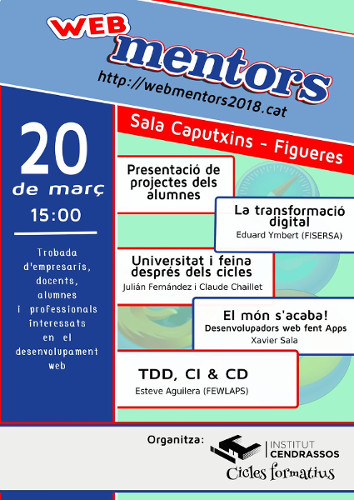
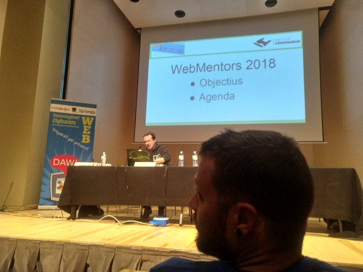
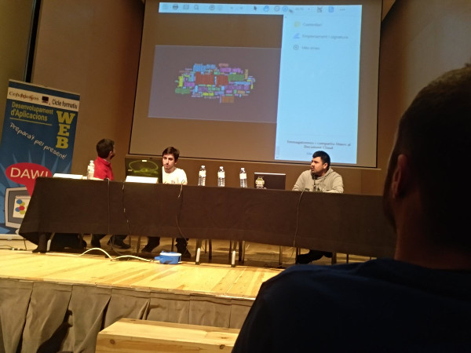
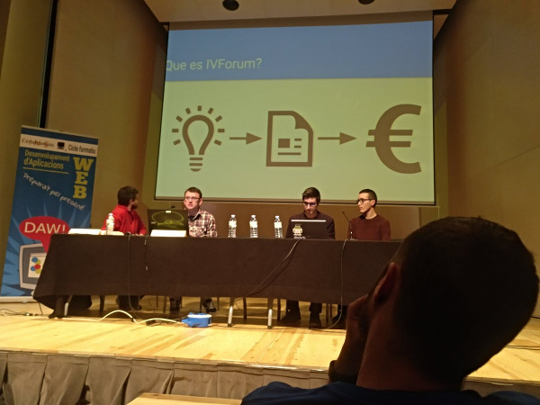
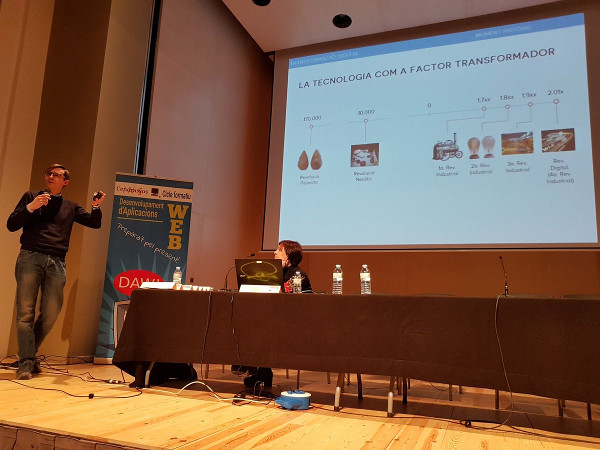
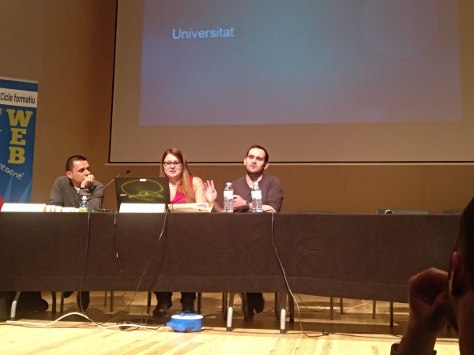
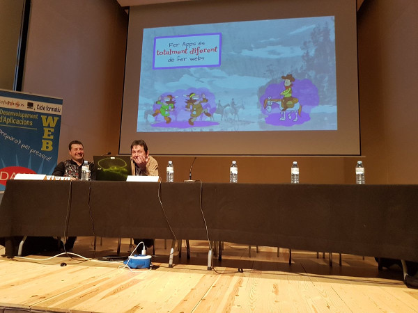
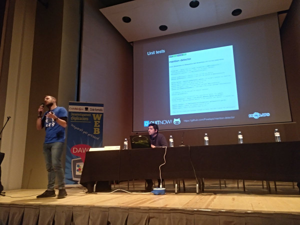

# Webmentors 2018

Material de les xerrades de la segona edició del WebMentors

## Presentació de projectes dels alumnes

## La transformació digital

### Eduard Ymbert

* Descarregar Transparències : Properament

## Universitat i feina després dels cicles

### Julián Fernández i Claude Chaillet

* Descarregar Transparències : Properament

## El món s'acaba: Desenvolupadors web fent APPs

### Xavier Sala Pujolar

* [Descarregar Transparències](ElMonSacaba/webapps.pdf)

## TDD, CI, CD i CD

### Esteve Aguilera

* Descarregar Transparències: Properament
